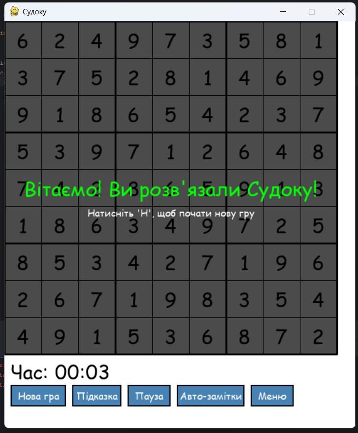

## 🔢Sudoku
A desktop Sudoku game built with Python and Pygame featuring multiple difficulty levels, state management, and SQLite database integration. The project includes a complete game engine with puzzle generation, validation, hint system, timer, leaderboards with a clean modular architecture.
## 🔑 Key Features

- 🎯 **Three Difficulty Levels**  
  Choose from Easy, Medium, or Hard to match your skill level.

- 🎮 **Game State Management**  
  Smooth transitions between Menu, Playing, Paused, and Game Over states.

- 💡 **Hint System with Usage Tracking**  
  Get hints when you're stuck, with stats to track how often you use them.

- ⏱️ **Timer and Personal Statistics**  
  See how long you take to solve puzzles and track your progress over time.

- 🗄️ **SQLite Database Integration**  
  Keep personal records reliably and efficiently.

- 🧩 **Clean Architecture**  
  Separation of core game logic, UI rendering, and database access for better maintainability and scalability.

### Strings of Code
- **Number of strings of code**


## 📁 Contents

- [`sudoku/core/`](sudoku/core/)  
  Core game logic including puzzle generation, validation, and board management.

- [`sudoku/game/`](sudoku/game/)  
  Game engine with state management (menu, playing, paused, game over) and timer functionality.

- [`sudoku/database/`](sudoku/database/)  
  SQLite database integration for saving games, records, and user settings using the repository pattern.

- [`sudoku/ui/`](sudoku/ui/)  
  User interface components including the Pygame renderer and button management system.

- [`sudoku/models/`](sudoku/models/)  
  Data models representing game entities like cells and difficulty settings.

- [`sudoku/utils/`](sudoku/utils/)  
  Helper functions for coordinates, time formatting, and other game utilities.

- [`sudoku/config.py`](sudoku/config.py)  
  Global settings and constants used across the project.


## 🚀 Getting Started

### ✅ Requirements

- 🐍 **Python 3.8** or newer  
- 🎮 **Pygame** library for graphics and user interface  
- 🗄️ **SQLite3** (included with Python standard library)  
- 🧠 Recommended IDE: **PyCharm**, **VS Code**, or any Python-compatible IDE

---

### 🔧 Setup and Running Locally

#### 1. Clone the Repository

```bash
git clone https://github.com/BondarchukOlexander23-2/Sudoku
cd sudoku-game
```

#### 2. Install Dependencies
```bash 
pip install pygame
```

#### Run the Game
You can start the game in one of two ways:
- Run the package as a module:
```bash
python -m sudoku
```
- Or run the main file directly:
```bash
python main.py
```

## 🎮 Game Controls

### 🖱️ Mouse
- **Click** to select cells and interact with UI buttons

### ⌨️ Keyboard
- **1-9**: Enter a number in the selected cell  
- **Shift + 1-9**: Toggle note mode for the selected cell  
- **Backspace / Delete / 0**: Clear the selected cell  
- **Arrow keys**: Navigate between cells  
- **H**: Use a hint  
- **A**: Auto-fill notes  
- **P** or **Space**: Pause the game  
- **Esc**: Return to the main menu


## 💾 Database

Game records and statistics are automatically saved in a local SQLite database: `sudoku.db`

No additional setup or configuration is needed.


## 🧩 Features

### 🎮 Single-Player Puzzle Game
- Classic Sudoku gameplay with **three difficulty levels**: Easy, Medium, Hard
- Puzzles are **automatically generated** with guaranteed unique solutions

### 🖼️ Pygame Graphics Interface
- Interactive desktop application with:
  - Clickable grid and number input
  - Visual feedback for selected cells
  - Conflict highlighting
  - Intuitive on-screen button controls

### 🧠 Complete Sudoku Logic
- Full puzzle validation and conflict detection
- Completion checking and **smart hint system**
- **Auto-notes** feature for displaying possible values

### 📊 Statistics & Records Storage
- Saves:
  - Completion times
  - Difficulty levels
  - Number of hints used
  - Player statistics
- Uses **SQLite** with **leaderboard** functionality

### 🔄 State Management System
- Smooth transitions between:
  - Main menu
  - Difficulty selection
  - Game session
  - Pause
  - Game over screen
  - Records/leaderboard view
- Ensures consistent and bug-free game flow

### 👤 User-Friendly Experience
- Clean and responsive interface:
  - Timer display
  - Hint counter
  - Pause/resume option
  - Keyboard shortcuts
  - Visual indicators of progress

### 🧱 Modular Architecture
- Well-structured codebase using:
  - Separation of concerns
  - Core logic, UI, DB, and states handled independently
  - **Repository** and **Factory** design patterns for scalability

## 📸 Screenshots

- **Main Window**:
  

- **Choose difficulty**:
   

- **Game window**:
  

- **Win game**:
  

- **Table records**:
  


## 🎯 Design Patterns

This project leverages several design patterns to ensure modularity, maintainability, and scalability:

### 🧠 Strategy Pattern
- **Used in**: `ISudokuGenerator` and `SudokuGenerator` classes
- **Purpose**: Allows interchangeable Sudoku generation algorithms without modifying client code
- **Implementation**: `SudokuGenerator` implements `ISudokuGenerator` using a backtracking algorithm. Other algorithms can be added in the future without changing the game logic

### 📦 Repository Pattern
- **Used in**: `IGameRecordRepository`, `ISavedGameRepository`, `IUserSettingsRepository` and their SQLite implementations
- **Purpose**: Abstracts data access logic and provides a unified interface for interacting with data sources
- **Implementation**: Each repository defines an interface (e.g., `IGameRecordRepository`) and a concrete implementation (`SQLiteGameRecordRepository`) to enable database switching or storage method expansion

### 🔄 State Pattern
- **Used in**: `IGameState`, `MainMenuState`, `PlayingState`, `PausedState`, `GameOverState`
- **Purpose**: Enables an object to change behavior based on its internal state, with clear separation of game states
- **Implementation**: Each game state contains its own logic for handling events, updating, and rendering—simplifying game lifecycle management

### 🏭 Factory Method
- **Used in**: Implicitly in `SudokuGenerator` to create puzzles of different difficulties
- **Purpose**: Encapsulates object creation logic without directly instantiating specific classes
- **Implementation**: The `generate` method accepts a `Difficulty` enum and returns a corresponding grid, abstracting creation details

### 🧰 Facade Pattern
- **Used in**: `GameDatabaseManager` class
- **Purpose**: Provides a simplified interface to a complex database subsystem
- **Implementation**: `GameDatabaseManager` coordinates between repositories and services, offering a clean API for the main `Game` class

---

## 🧩 Programming Principles

The project follows key programming principles to ensure clean, maintainable, and efficient code:

### 🔷 SOLID Principles
- **Single Responsibility Principle**: Each class has one responsibility (e.g., `SudokuBoard` manages grid state, `SudokuValidator` handles validation)
- **Open/Closed Principle**: Classes are open for extension (via interfaces like `ISudokuGenerator`) but closed for modification
- **Liskov Substitution Principle**: Interface implementations (e.g., `SQLiteGameRecordRepository`) can replace their base types without affecting functionality
- **Interface Segregation Principle**: Interfaces are small and specific (e.g., `ISudokuBoard` only includes board-related methods)
- **Dependency Inversion Principle**: High-level modules (e.g., `Game`) depend on abstractions (`ISudokuGenerator`, `ISudokuBoard`) rather than concrete classes

### 🔁 DRY (Don't Repeat Yourself)
- Reused logic is centralized (e.g., `SudokuValidator` handles all validation; state handling follows the State pattern)

### 💡 KISS (Keep It Simple, Stupid)
- Design remains simple and focused: clear class responsibilities, centralized move validation, and well-separated UI components

### 🚫 YAGNI (You Aren't Gonna Need It)
- Only necessary features are implemented (e.g., core Sudoku rules, game saving, statistics); speculative features are avoided

---

## 🔄 Refactoring Techniques

This project applies several refactoring techniques to improve structure, readability, and maintainability:

### 📦 Extract Class
- **Used in**: `GameDatabaseManager`, `GameTimer`, `ButtonManager`, `SudokuRenderer`
- **Purpose**: Moves related functionality into separate classes to reduce complexity
- **Example**: `ButtonManager` extracted from `Game` to manage UI buttons; `GameTimer` isolated to manage game time

### 🧪 Extract Method
- **Used in**: `SudokuBoard` (`get_hint`, `auto_notes`), `Game` (`_load_user_settings`, `_get_preferred_difficulty`)
- **Purpose**: Breaks complex methods into smaller, reusable pieces
- **Example**: `_load_user_settings` in `Game` encapsulates user settings loading during initialization

### 🧬 Replace Conditional with Polymorphism
- **Used in**: State pattern implementation (`MainMenuState`, `PlayingState`, etc.)
- **Purpose**: Eliminates conditional logic in favor of polymorphic behavior
- **Example**: Each state class defines its own `handle_event`, `update`, and `render` methods instead of `if-else` logic

### 🧳 Introduce Parameter Object
- **Used in**: `Cell` class and `Difficulty` enum
- **Purpose**: Replaces multiple parameters with a single object for cleaner method signatures
- **Example**: `Cell` holds all data (value, notes, state), simplifying parameter passing

### 🔢 Replace Magic Numbers with Named Constants
- **Used in**: `config.py` (e.g., `GRID_SIZE`, `SUB_GRID_SIZE`, `CELL_SIZE`, `MAX_HINTS`)
- **Purpose**: Improves clarity and maintainability by using named constants
- **Example**: Use `GRID_SIZE = 9` instead of hardcoded `9` throughout the code

### 📤 Move Method
- **Used in**: Moved validation logic from `SudokuBoard` to `SudokuValidator`
- **Purpose**: Improves cohesion by placing methods where they logically belong
- **Example**: `is_valid_move` and `is_board_valid` moved to `SudokuValidator`

### 📑 Extract Interface
- **Used in**: `ISudokuGenerator`, `ISudokuBoard`, `IGameState`, repository interfaces
- **Purpose**: Enables polymorphism and flexibility by defining shared operations in interfaces
- **Example**: `ISudokuBoard` defines a common contract for all board implementations

### 📝 Rename Method/Variable
- **Used throughout**: To improve semantics and self-documenting code
- **Purpose**: Makes code easier to read and understand
- **Example**: Renamed `init` → `initialize`, `check_finished` → `is_complete` for better clarity


### Thank you for your attention!